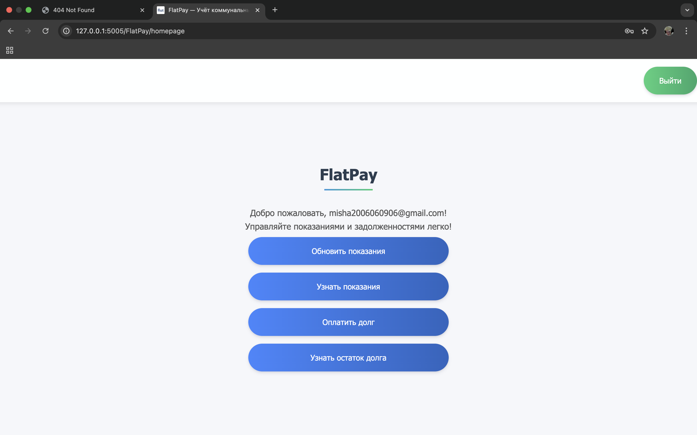

# 🚰 FlatPay

## 📌 Описание

**FlatPay** — это асинхронное веб-приложение, реализованное по архитектуре **MVC (Model-View-Controller)**  
с чётким разделением на:

- **Модели** — описание и валидация структуры данных
- **Контроллеры** — логика обработки запросов
- **Представления** — шаблоны HTML-страниц

> Цель проекта — предоставить пользователю удобный инструмент для учёта и оплаты коммунальных услуг.

---

## ⚙️ Функциональность

- 🔐 **Регистрация / Авторизация / Выход**
- 📈 **Ввод и обновление показаний счётчиков**  
  (доступно с определённого числа месяца)
- 📊 **Автоматический расчёт задолженности**
- 💸 **Оплата текущей задолженности**
- 🔍 **Просмотр текущей задолженности и показаний**
- 📅 **Автоматические задачи (APScheduler):**
  - Обнуление показаний 1-го числа каждого месяца
  - Перенос долга из `next_month_debt` в `debt`
- 🛡 **Безопасность**  
  (все конфиденциальные данные загружаются через `.env`)

---

## 🧰 Технологии

| Назначение         | Технологии                         |
|--------------------|-------------------------------------|
| Веб-фреймворк      | [Quart](https://pgjones.gitlab.io/quart/) |
| Асинхронность      | `asyncio`, `uvicorn`               |
| База данных        | [aiosqlite](https://github.com/jreese/aiosqlite) |
| Валидация данных   | [Pydantic](https://docs.pydantic.dev/) |
| Конфигурация       | [pyYAML](https://pyyaml.org/), [environs](https://pypi.org/project/environs/) |
| Планировщик задач  | [APScheduler](https://apscheduler.readthedocs.io/en/latest/) |
| Логирование        | `logging`, YAML-конфигурация       |
| Интерфейс          | HTML, CSS                          |

---

## 📁 Структура проекта

```bash
FlatPay/
├── var/
│   ├── db/                 # Файлы базы данных
│   └── logs/               # Лог-файлы приложения
├── src/
│   └── FlatPay/
│       ├── app/            # MVC-архитектура
│       │   ├── controllers/  # Роуты и обработчики
│       │   ├── models/       # Pydantic-модели
│       │   └── views/        # HTML-шаблоны и статические файлы
│       ├── core/           # Ядро приложения
│       │   ├── config/       # Загрузка переменных окружения
│       │   ├── exceptions/   # Кастомные исключения
│       │   ├── logger/       # Логирование
│       │   ├── middlewares/  # Middleware-функции
│       │   └── setup_app.py  # Фабрика приложения
│       ├── database/
│       │   ├── connection.py     # Подключение к БД
│       │   └── repositories/     # CRUD-операции
│       ├── tasks/
│       │   ├── jobs/             # Периодические задачи
│       │   ├── background.py     # Запуск задач
│       │   └── scheduler.py      # Запуск и остановка планировщика
│       ├── services/
│       │   ├── payments/         # Работа с задолженностью
│       │   ├── readings/         # Работа с показаниями
│       │   └── user/             # Управление пользователями
│       ├── utils/
│       │   ├── calculate_base_debt.py
│       │   ├── security.py
│       │   └── validators.py
│       └── requirements.txt      # Зависимости
├── .env                      # Переменные окружения
└── main.py                   # Точка входа
```

## 🧩 Архитектура

Архитектура проекта описана в [docs/architecture.md](docs/architecture.md)

## 📸 Скриншот интерфейса



## Установка и запуск

1. Клонируйте репозиторий:
   ```bash
   git clone https://github.com/Flameeee812/FlatPay
   cd flatpay
   ```

2. Создайте виртуальное окружение:
   ```bash
   python -m venv venv
   source venv/bin/activate  # для Linux/Mac 
   venv\Scripts\activate     # для Windows
   ```

3. Установите зависимости:
   ```bash
   pip install -r requirements.txt
   ```

4. Создайте файл .env для переменных окружения:
   Пример содержимого:
   ```
   SECRET_KEY=your_secret_key
   DATABASE_URL=sqlite:///db.sqlite3
   ```

5. Запустите приложение:
   ```bash
   PYTHONPATH=src python run.py
   ```